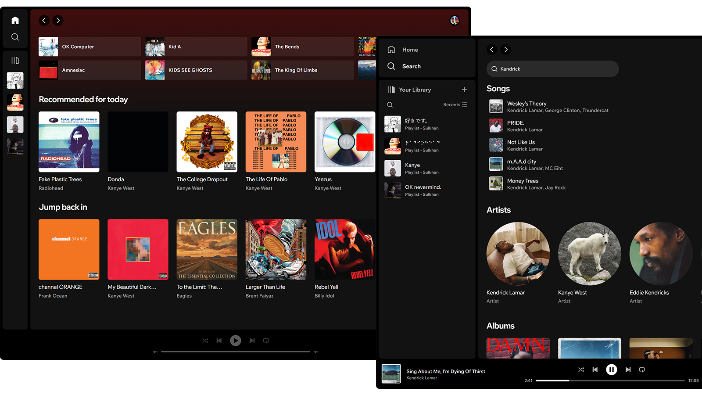
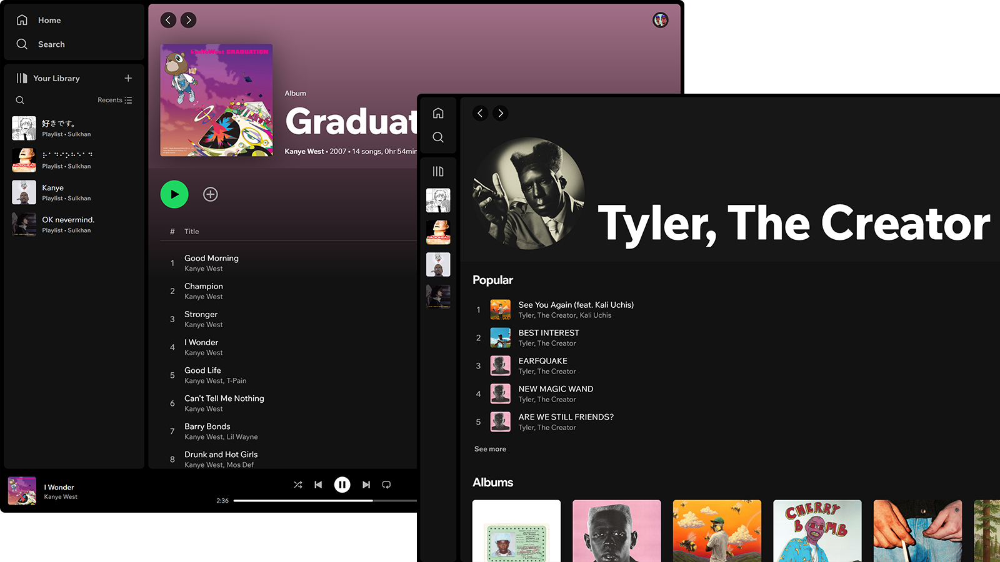

# Spotify

A clone of the Spotify Web Player built using Next.js, Tailwind CSS, the Spotify Web API, and the fast-average-color library. Users can connect to their own Spotify accounts, browse their Spotify library, search for artists, albums, and playlists, and create new playlists. Some features, such as viewing the song queue and using playback, are only available to Spotify Premium users.

## Screenshots




## Features

- **Connect to Spotify:** Users can connect their Spotify accounts to access their personal libraries.
- **Browse Library:** Browse through your Spotify library, including saved songs, albums, and playlists.
- **Search:** Search for artists, albums, and playlists within Spotify.
- **Create Playlist:** Create new playlists directly from the web player.
- **Premium Features:** Spotify Premium users can view the song queue and use playback controls.

## Technologies Used

- **[Next.js](https://nextjs.org/):** React framework for building the web application.
- **[Tailwind CSS](https://tailwindcss.com/):** Utility-first CSS framework for styling.
- **[Spotify Web API](https://developer.spotify.com/documentation/web-api/):** Official API provided by Spotify for accessing Spotify's data and features.
- **[Fast Average Color](https://github.com/fast-average-color/fast-average-color):** Library for extracting the dominant color from an image.
- **Context API:** React's built-in way to manage global state in the application.

## Color Palette

Primary colors used in this project:

- **Base:** #121212
- **Highlight:** #1a1a1a
- **Secondary Highlight:** #2a2a2a
- **Primary Text:** #ffffff
- **Sublte Text:** #b3b3b3
- **Gray:** #a7a7a7
- **Green:** #1ed760

## Spotify API Setup

1. Go to [Spotify Developer Dashboard](https://developer.spotify.com/dashboard)
2. Log in with your Spotify account
3. Click "Create New App"
4. Fill in the app details:
   - App name: Your choice
   - App description: Your choice
   - Website: `http://localhost:3000` (for development)
   - Redirect URI: `http://localhost:3000`
   - Select Web API
5. After creating the app, you'll get your `Client ID`
6. In your app settings:
   - Add `http://localhost:3000` to Redirect URIs
   - Save the changes

## Environment Variables

Create a `.env` file in the root directory with the following variables:

```env
NEXT_PUBLIC_SPOTIFY_CLIENT_ID=your_spotify_client_id
NEXT_PUBLIC_SPOTIFY_REDIRECT_URI=http://localhost:3000
```

## Installation

1. Clone the repository:

```bash
git clone https://github.com/Sulkhans/Spotify.git
cd Spotify
```

2. Install dependencies:

```bash
npm install
# or
yarn install
```

3. Run the development server:

```bash
npm run dev
# or
yarn dev
```

Open [http://localhost:3000](http://localhost:3000) in your browser to see the result.
